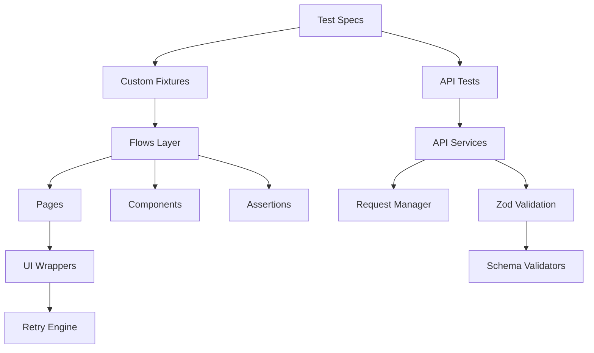

# 🚀 SmartShop — Enterprise E-Commerce Testing Portfolio

<div align="center">

# ⚡ Enterprise Grade Playwright + TypeScript Automation Framework

### UI Automation • API Automation • Architecture • CI/CD • Scalability • Enterprise QA Engineering

<br>


<br>

## 🏆 Enterprise QA Engineering Portfolio Project

### Designed to simulate real-world large-scale product company automation architecture

</div>

---

# 📌 Table of Contents

1. Introduction
2. Why This Project Exists
3. Project Vision
4. Enterprise Engineering Goals
5. Core Highlights
6. Repository Structure
7. Architecture Overview
8. Tech Stack
9. Framework Design Philosophy
10. UI Automation Architecture
11. API Automation Architecture
12. Validation Architecture
13. Flow Layer Design
14. Retry Engine Design
15. Stability Engineering
16. Locator Governance
17. Test Data Strategy
18. Environment Strategy
19. Authentication Strategy
20. Reporting & Evidence Collection
21. Logging Strategy
22. Parallel Execution Strategy
23. Scalability Engineering
24. Docker Strategy
25. Kubernetes Strategy
26. CI/CD Pipeline Strategy
27. Manual Testing Assets
28. Documentation Strategy
29. Folder-by-Folder Deep Dive
30. Project Features
31. Enterprise Design Patterns
32. Error Handling Strategy
33. Flaky Test Prevention
34. API Validation Using Zod
35. Performance Considerations
36. Security Testing Strategy
37. Future Improvements
38. Quick Start
39. Installation
40. Running UI Tests
41. Running API Tests
42. Running Smoke Suites
43. Running Regression Suites
44. Running E2E Suites
45. Running Stress Suites
46. Reports & Traces
47. Troubleshooting
48. Interview Talking Points
49. Why This Project Is Different
50. Final Notes

---

# 🚀 Introduction

SmartShop Enterprise Testing Portfolio is a complete enterprise-grade automation ecosystem designed for modern large-scale E-Commerce applications.

This repository is intentionally designed far beyond a normal automation project.

Most testing repositories demonstrate:

* Small Playwright scripts
* Simple Page Object Models
* Few UI test cases
* Basic assertions

This project demonstrates:

✅ Enterprise QA architecture
✅ Scalable automation design
✅ UI + API automation systems
✅ Stability engineering
✅ Retry governance
✅ Flaky test prevention
✅ CI/CD engineering
✅ Docker & Kubernetes scaling strategy
✅ Enterprise documentation systems
✅ Manual + automated testing integration

This repository represents how large-scale product companies design modern QA engineering systems.

---

# 🎯 Why This Project Exists

Modern software systems are extremely complex.

Traditional automation frameworks fail because they become:

* Difficult to maintain
* Highly flaky
* Hard to scale
* Slow to debug
* Expensive to execute
* Impossible to govern

This project was designed to solve those problems using enterprise engineering principles.

The primary goals were:

* Build maintainable automation
* Build scalable automation
* Build stable automation
* Build reusable architecture
* Build CI/CD-ready automation
* Simulate enterprise QA systems

---

# 🏆 Project Vision

The vision of this project is to demonstrate:

## Enterprise-Level Thinking

Instead of only writing test scripts, this repository demonstrates:

* Architecture design
* Dependency management
* Stability engineering
* Retry governance
* Parallel execution strategy
* Environment strategy
* Data strategy
* Long-term maintainability

---

# 🔥 Enterprise Engineering Goals

## Primary Goals

### ✅ Scalability

The framework should scale from:

* Small local execution
  to
* Large distributed CI/CD execution

---

### ✅ Stability

The framework should remain stable even when:

* UI rendering changes
* Timing becomes inconsistent
* CI environments become slower
* Parallel workers increase

---

### ✅ Maintainability

The architecture should remain maintainable even after:

* Hundreds of tests
* Multiple engineers
* Large feature additions
* Environment expansion

---

### ✅ Reusability

Reusable layers were created for:

* Flows
* Assertions
* Components
* API services
* Request handling
* Validation systems

---

# ✨ Core Highlights

# ✅ UI Automation

* Playwright + TypeScript
* Smoke testing
* Regression testing
* End-to-end testing
* Stress testing
* Flow layer architecture
* Page Object Model
* Component Model
* Retry wrappers
* Screenshot evidence collection

---

# ✅ API Automation

* Request manager pattern
* Base client architecture
* API service layer
* Zod schema validation
* Logging & diagnostics
* Endpoint centralization
* Negative testing

---

# ✅ Enterprise Documentation

* Test strategy
* Test plan
* Automation architecture
* Locator governance
* Retry strategy
* Flaky handling strategy
* CI/CD strategy
* Kubernetes blueprint
* Parallel execution strategy

---

# 🏗 Repository Structure

```text
Software Web Testing/
│
├── Real Automation Testing/
│   │
│   ├── test-platform/
│   │   ├── api/
│   │   ├── config/
│   │   ├── core/
│   │   ├── data/
│   │   ├── reports/
│   │   ├── tests/
│   │   ├── ui/
│   │   └── validation/
│   │
│   ├── playwright.config.ts
│   ├── package.json
│   └── .env
│
├── Automation Testing demo/
│
├── document1/
│
├── document2/
│
└── Manual Testing/
```

---

# 🧠 Architecture Overview



---

# ⚡ Tech Stack

| Category         | Technology             |
| ---------------- | ---------------------- |
| Automation       | Playwright             |
| Language         | TypeScript             |
| API Validation   | Zod                    |
| Runtime          | Node.js                |
| Environment      | dotenv                 |
| CI/CD            | GitHub Actions         |
| Containerization | Docker                 |
| Scaling          | Kubernetes             |
| Reporting        | Playwright HTML Report |

---

# 🏗 Framework Design Philosophy

The framework follows a layered architecture approach.

Instead of mixing:

* locators
* assertions
* waits
* business logic
* retries

inside specs, everything is separated into dedicated layers.

This improves:

* readability
* maintainability
* scalability
* debugging
* governance

---

# 🎨 UI Automation Architecture

The UI automation layer is divided into:

## 1. Pages Layer

Responsible for:

* locators
* low-level interactions
* reusable page methods

Pages should never contain:

* assertions
* business flows
* retry logic

---

## 2. Components Layer

Reusable UI pieces:

* Navbar
* Search
* Drawers
* Product cards
* Filters

This avoids duplication across pages.

---

## 3. Flow Layer

Business journeys are handled in flows.

Examples:

* Login flow
* Checkout flow
* Category flow

Flows orchestrate multiple pages/components together.

---

## 4. Validation Layer

Assertions are centralized.

Benefits:

* reusable assertions
* smaller specs
* easier debugging
* better consistency

---

# 🔥 API Automation Architecture

The API architecture follows enterprise layering.

---

# Client Layer

Responsible for:

* HTTP methods
* Request execution
* Base request handling

---

# Request Manager

Centralized handling for:

* retries
* headers
* logging
* configuration

---

# Service Layer

Business API actions.

Examples:

* AuthService
* ProductService
* CartService

---

# Validation Layer

Zod schemas validate:

* response structure
* data types
* contracts

---

# 🧪 Validation Architecture

Validation is separated from pages and flows.

This is extremely important.

Why?

Because:

* pages should not know expected outcomes
* assertions should remain reusable
* specs should remain readable

---

# 🔄 Retry Engine Design

The framework contains a lightweight retry engine.

Purpose:

* stabilize flaky UI interactions
* handle rendering delays
* reduce intermittent failures

Retry logic is centralized.

Specs never contain random retry loops.

---

# 🛡 Stability Engineering

Stability engineering is one of the most important parts of this project.

The framework prevents instability using:

* explicit expectations
* stable locators
* centralized wrappers
* isolation-first execution
* governed retries

---

# 🎯 Locator Governance

Locator strategy follows strict governance rules.

Priority order:

1. data-testid
2. getByRole
3. semantic attributes
4. stable CSS
5. XPath (avoid)

---

# ❌ Strict Prohibitions

* No absolute XPath
* No nth-child chains
* No deep DOM traversal
* No hardcoded indexes

---

# 📦 Test Data Strategy

The framework supports:

* static datasets
* factories
* dynamic generation
* domain-specific datasets

This enables:

* parallel execution
* worker isolation
* deterministic testing

---

# 🌍 Environment Strategy

Different environments require different execution strategies.

Supported concepts:

* local
* dev
* staging
* production-safe smoke testing

---

# 🔐 Authentication Strategy

Authentication uses:

* Playwright storage state
* reusable authenticated sessions

Benefits:

* faster execution
* reduced login duplication
* stable auth handling

---

# 📊 Reporting & Evidence Collection

The framework collects:

* screenshots
* traces
* logs
* HTML reports
* retry diagnostics

This improves debugging significantly.

---

# 📝 Logging Strategy

API logging captures:

* endpoint
* request payload
* response payload
* status code
* failure diagnostics

This improves root cause analysis.

---

# ⚡ Parallel Execution Strategy

Parallel execution requires:

* isolated workers
* isolated data
* independent tests

The framework is designed with those principles.

---

# 🚀 Scalability Engineering

The architecture is intentionally designed for future scaling.

The documentation defines scaling strategies for:

* Docker execution
* distributed execution
* Kubernetes orchestration

---

# 🐳 Docker Strategy

Docker strategy includes:

* browser containers
* Playwright dependencies
* environment injection
* artifact collection

---

# ☸ Kubernetes Strategy

Kubernetes blueprint includes:

* sharded execution
* pod isolation
* scalable workers
* artifact handling

---

# 🔥 CI/CD Pipeline Strategy

CI/CD strategy includes:

* GitHub Actions
* artifact upload
* environment configuration
* retry governance
* smoke gating

---

# 🧪 Manual Testing Assets

The repository also contains:

* manual test cases
* test scenarios
* execution planning
* RTM documents
* reports

---

# 📚 Documentation Strategy

This repository contains extensive documentation covering:

* architecture
* governance
* scalability
* retries
* locator policies
* risk management
* CI/CD systems

---

# 📂 Folder-by-Folder Deep Dive

# test-platform/

Main enterprise framework.

Contains:

* UI automation
* API automation
* validation
* retries
* wrappers
* fixtures

---

# core/

Framework engine.

Contains:

* fixtures
* hooks
* wrappers
* retry engine
* utilities

---

# ui/

Contains:

* pages
* components
* flows

---

# validation/

Reusable assertion systems.

---

# api/

Contains:

* services
* clients
* schemas
* validators

---

# 🧩 Enterprise Design Patterns

Patterns used:

* Page Object Model
* Component Model
* Flow Layer Pattern
* Service Layer Pattern
* Factory Pattern
* Dependency Injection
* Retry Wrapper Pattern

---

# ❌ Error Handling Strategy

The framework avoids silent failures.

Errors are:

* logged
* categorized
* surfaced with evidence

---

# 🚫 Flaky Test Prevention

Flaky prevention strategies:

* deterministic waits
* isolation-first execution
* governed retries
* stable locators
* centralized wrappers

---

# 🔍 API Validation Using Zod

Zod validates:

* response contracts
* required fields
* types
* nested structures

This improves API confidence dramatically.

---

# ⚡ Performance Considerations

Performance strategies include:

* reusable auth
* centralized setup
* worker optimization
* parallel execution
* retry governance

---

# 🔒 Security Testing Strategy

Documented future security areas:

* auth validation
* token testing
* negative authorization scenarios
* input validation

---

# 🚀 Future Improvements

Future roadmap includes:

* visual testing
* AI-based testing
* self-healing locators
* contract testing
* performance testing
* dashboard reporting

---

# ⚡ Quick Start

# 1. Clone Repository

```bash
git clone <repository-url>
```

---

# 2. Install Dependencies

```bash
cd "Software Web Testing/Real Automation Testing"

npm install
```

---

# 3. Install Browsers

```bash
npx playwright install
```

---

# ▶️ Running UI Tests

```bash
npx playwright test --config=test-platform/config/playwright.ui.config.ts
```

---

# ▶️ Running API Tests

```bash
npx playwright test --config=test-platform/config/playwright.api.config.ts
```

---

# ▶️ Running Smoke Suites

```bash
npx playwright test tests/ui/smoke
```

---

# ▶️ Running Regression Suites

```bash
npx playwright test tests/ui/regression
```

---

# ▶️ Running E2E Suites

```bash
npx playwright test tests/ui/e2e
```

---

# ▶️ Running Stress Suites

```bash
npx playwright test tests/ui/stress
```

---

# 📊 Reports & Traces

# HTML Reports

```bash
npx playwright show-report
```

---

# Trace Collection

```ts
trace: 'on-first-retry'
```

---

# 🛠 Troubleshooting

# Wrong Working Directory

Always execute from:

```bash
cd "Software Web Testing/Real Automation Testing"
```

---

# Base URL Issues

Update:

* playwright.ui.config.ts
* playwright.api.config.ts

---

# Strict Locator Failures

Use:

* better selectors
* role locators
* test IDs

---

# Timing Instability

Avoid:

```ts
page.waitForTimeout()
```

Prefer:

```ts
expect(locator).toBeVisible()
```

---

# 💡 Interview Talking Points

# Why This Architecture?

* maintainability
* scalability
* readability
* stability

---

# Why Flow Layer?

To separate business journeys from low-level interactions.

---

# Why Assertions Layer?

To centralize validation and reduce duplication.

---

# Why Retry Governance?

To avoid uncontrolled flaky handling.

---

# Why Zod?

To validate API contracts reliably.

---

# 🚀 Why This Project Is Different

Most automation projects show:

* simple scripts
* basic POM
* limited testing

This project demonstrates:

✅ Enterprise architecture
✅ Engineering mindset
✅ Scalability planning
✅ Stability governance
✅ CI/CD readiness
✅ Automation strategy
✅ QA system design

---

# 👨‍💻 Author

# Gaurav Khope

### SDET | QA Automation Engineer | Playwright Engineer

Focused on building:

* scalable automation systems
* enterprise frameworks
* modern QA engineering architecture

---

# ⭐ Support

If you found this project valuable:

⭐ Star the repository
🍴 Fork the repository
📢 Share with others

---

# 📜 License

Licensed under the ISC License

---

<div align="center">

# 🚀 SmartShop Enterprise Testing Portfolio

## Built with Enterprise QA Engineering Principles

### Playwright • TypeScript • API Testing • CI/CD • Scalability

</div>

